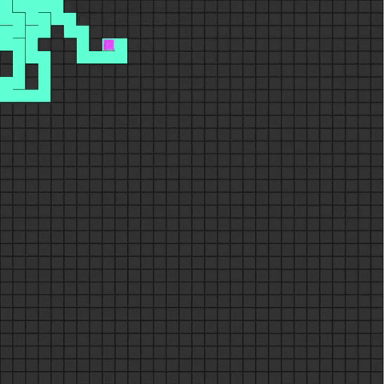
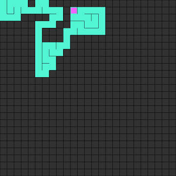
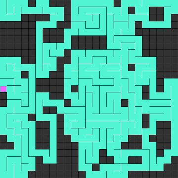
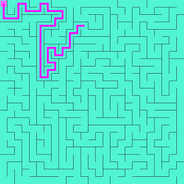
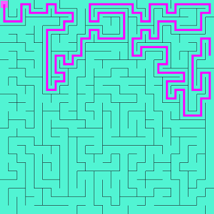
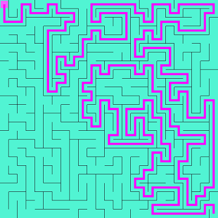
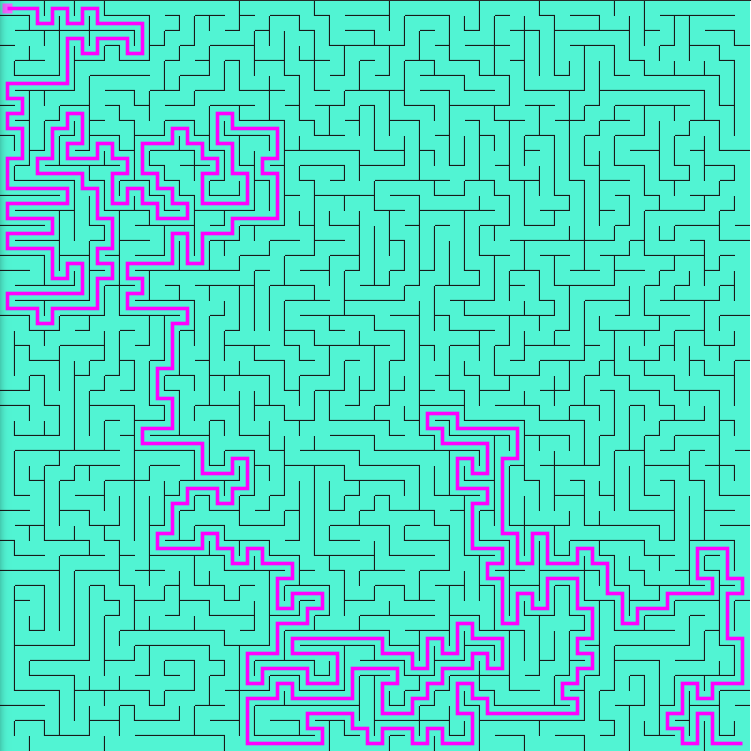
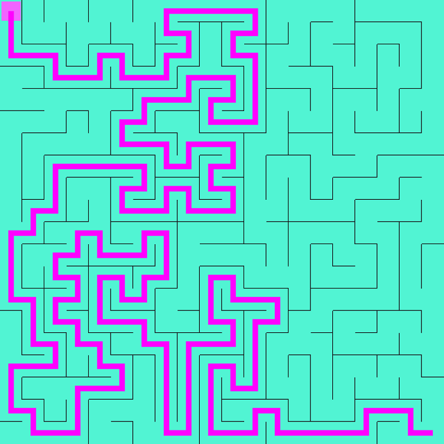
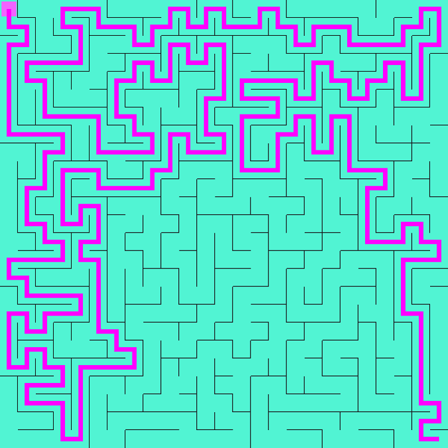
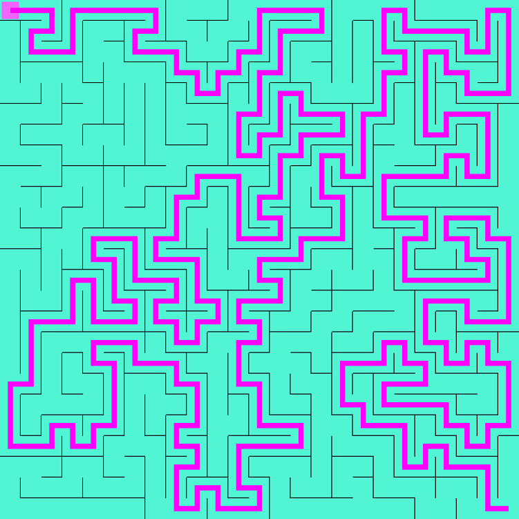

# Maze Solver

#### Maze generation using Depth First Search (recursive backtracking) algorithm.

#### Maze solving using A\* (A-star) (path finding) algorithm.

It's Animating otherwise it only take a split second for even 1000x1000 grid.

Inspired by [@daniel shiffman](https://github.com/CodingTrain)
It's so satisfying to see it creating, isn't it?😍

Go and visit the [link](https://amishranpariya.github.io/maze_solver/) to see it live.🎉🥳
PS: hit spacebar when done to download your very own SOLVED maze.

#### Examples

> Happy coding🥰
